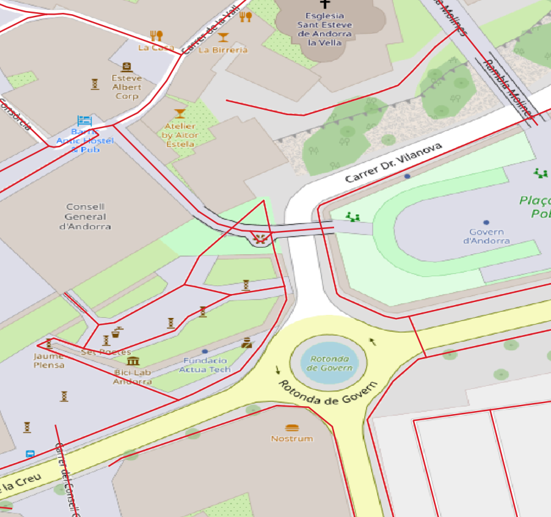
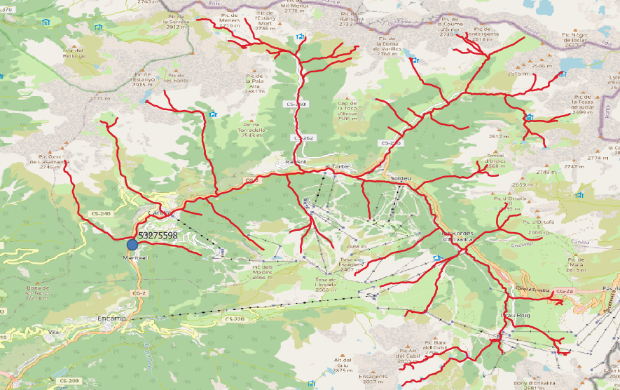
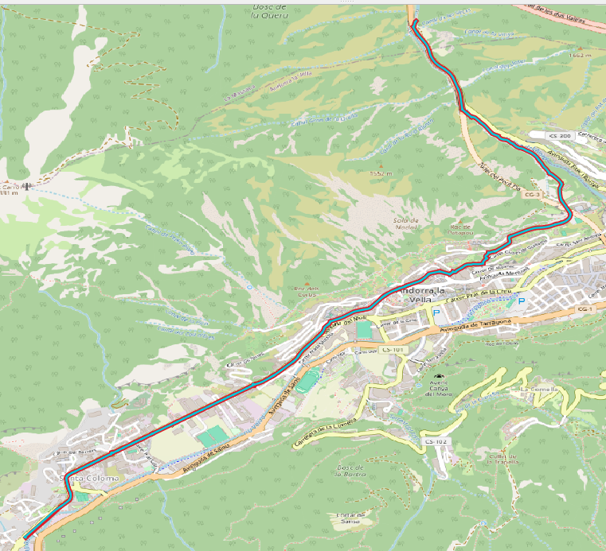
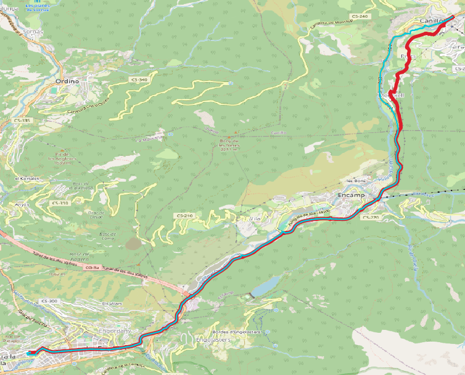
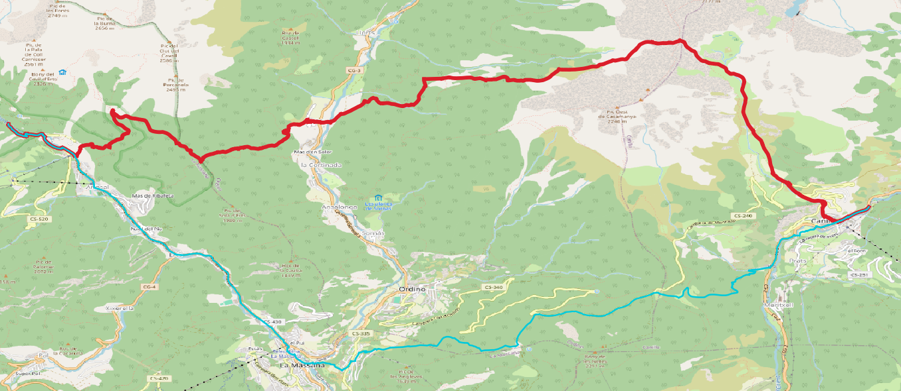

# osm2pgsql-topology

An attempt to develop a generalizable way to make topological networks from OpenStreetMap Data using [osm2pgsql](https://osm2pgsql.org/).

**NOTE:** The examples and indeed this entire repo make heavy use of docker:

* [Docker installation guide](https://docs.docker.com/engine/install/)
* [Docker post-installation steps](https://docs.docker.com/engine/install/linux-postinstall/)

If you really don't want to use docker, you can probably piece together the steps by looking at the scripts and reading
the instructions, but you're on your own otherwise.

## General idea

Use a [flex-output](https://osm2pgsql.org/doc/manual.html#the-flex-output) style file to create two tables:

* `edges_pre`: Contains the raw geometry of the linestring features you want in your network
* `node_tags`: Contains the tags for all the nodes

After this, Run the SQL files `./mnt/sql/create_nodes_table.sql` and `./mnt/sql/create_edges_table.sql`. You should then
have tables called `osm_edges` and `osm_nodes` which use their OSM ids as their identifiers. `osm_edges` contains
source and target columns which refer to ids in `osm_nodes`.

## Example 1: Pedestrian Routing

You can create a pedestrian routing network like so:

```sh
wget -O mnt/data.osm.pbf https://download.geofabrik.de/europe/andorra-latest.osm.pbf
docker compose up -d
docker compose run --rm osm2pgsql \
  -s \
  -d o2p_topo \
  -U o2p_topo \
  -H postgis \
  -P 5432 \
  -O flex \
  -S /mnt/style/style_pedestrian.lua \
  /mnt/data.osm.pbf
docker compose exec postgis psql -d o2p_topo -U o2p_topo -f /mnt/sql/create_nodes_table.sql
docker compose exec postgis psql -d o2p_topo -U o2p_topo -f /mnt/sql/create_edges_table.sql
```

You now have a topologically intact network of walkable OSM ways:



## Example 2: Waterway mapping

Inspired by the presentation by Amanda McCann at the State of the Map Europe 2024 conference.

You can create a waterway network using the style file at `./mnt/style/style_waterways.lua`:

```sh
wget -O mnt/data.osm.pbf https://download.geofabrik.de/europe/andorra-latest.osm.pbf
docker compose up -d
docker compose run --rm osm2pgsql \
  -s \
  -d o2p_topo \
  -U o2p_topo \
  -H postgis \
  -P 5432 \
  -O flex \
  -S /mnt/style/style_waterways.lua \
  /mnt/data.osm.pbf
docker compose exec postgis psql -d o2p_topo -U o2p_topo -f /mnt/sql/create_nodes_table.sql
docker compose exec postgis psql -d o2p_topo -U o2p_topo -f /mnt/sql/create_edges_table.sql
```

You now have a topologically intact waterway map. A neat thing you can do now is calculate watersheds using the query at
`./mnt/sql/create_watershed.sql` (just make sure you choose the right OSM ids for the node):

```sh
docker compose exec postgis psql -d o2p_topo -U o2p_topo -f /mnt/sql/calculate_watershed.sql
```

You now have a table called `pgr_res` containing the watershed for the OSM node id `53275598` (or something else if you
changed it in the SQL file):



## Example 3 (work in progress): Replacement for osm2pgrouting

[osm2pgrouting](https://pgrouting.org/docs/tools/osm2pgrouting.html) is a pretty much dead project at this point and I
thought that maybe it could be resurrected using osm2pgsql. I have tried to wrangle the OSM .pbf data into the exact
same output as running osm2pgrouting on an equivalent .osm file. I think it is like 90% there but not quite a perfect
drop-in replacement.

If you want to give it a try, execute this

```sh
docker compose up -d
wget -O mnt/data.osm.pbf https://download.geofabrik.de/europe/andorra-latest.osm.pbf
docker compose run --rm osmium cat /mnt/data.osm.pbf -o /mnt/data.osm --overwrite
./osm2pgrouting.sh /mnt/data.osm
./osm2pgsql-topology.sh /mnt/data.osm /mnt/style/osm2pgr_default.lua
```

Running the above code will:

1. Initialize a database on at `localhost:5432` with user `o2p_topo` and password `o2p_topo`
2. Download a sample OSM PBF dump from [Geofabrik](https://download.geofabrik.de/) (Andorra)
3. Convert the downloaded OSM OBF dump to an `.osm` file (osm2pgrouting needs this)
4. Build a default osm2pgrouting database
5. Build my best attempt at re-creating the default osm2pgrouting database using osm2pgsql on the same data.

### Benchmarking

You can compare the results of my implementation against osm2pgrouting by running:

```sh
docker compose run --rm benchmark
```

This will run the code in `./benchmark/benchmark.py`. It will pick 1000 random node pairs from the database and solve the
pgRouting Dijkstra shortest path between them. The table `public.route_result` contains the osm2pgsql-topology results,
the table `osm2pgr.route_result` contains the osm2pgrouting results. They are linked via the `trial` column. The `trial`
column is actually a `DATETIME` type, because it allows you to use the
[QGIS Time Slider functionality](https://www.qgistutorials.com/en/docs/3/animating_time_series.html) to quickly step
between "frames". The results are separated by one "second".

The file `./benchmark/benchmark.py` is mounted in its respective container, so any modifications you make to it will be
reflected when running it afterwards.

Here is an example of a single benchmark trial where this implementation gave exactly the same result as osm2pgrouting:



Here is an example of a single benchmark trial where this implementation gave a similar, but ultimately different result:



Here is an example of a single benchmark trial where this implementation gave a very different result:




